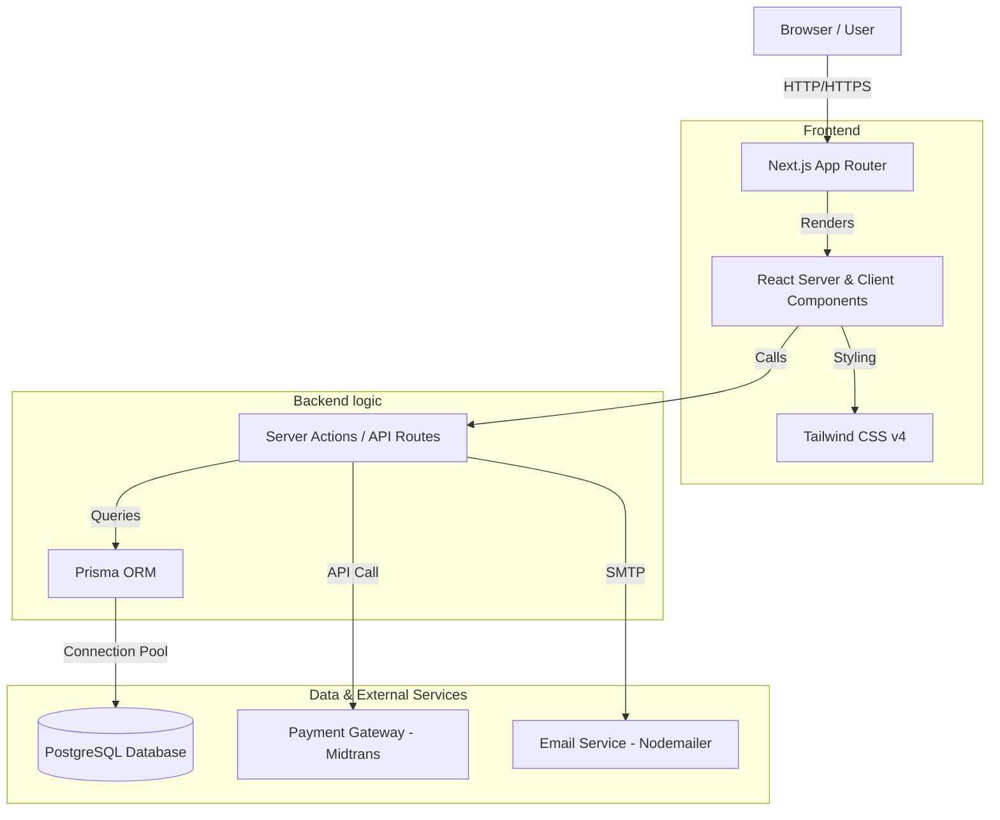
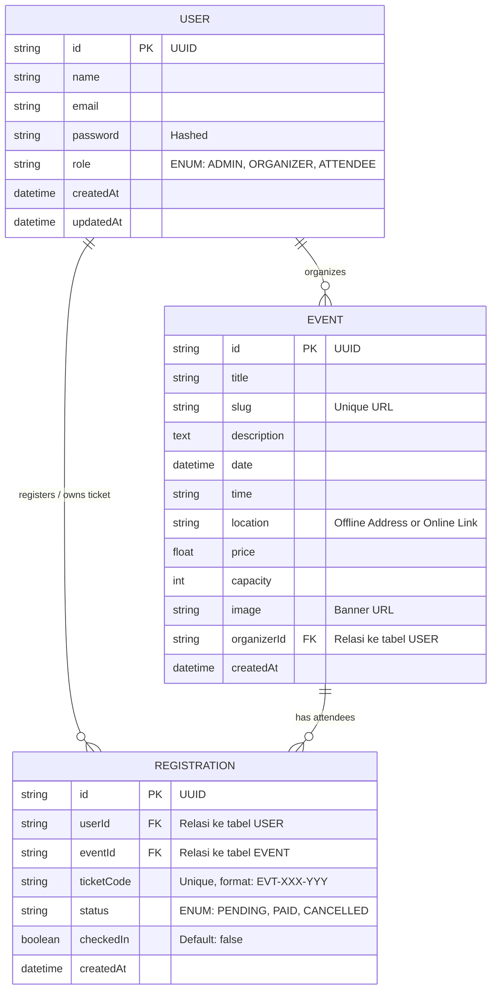

# Product Requirements Document (PRD) - Event Management System

## 1. Project Overview
**Nama Proyek:** EventTix (Event Management System)
**Deskripsi:** Platform web untuk membuat, mengelola, dan mendaftar event/seminar. Proyek ini bertujuan untuk menunjukkan kemampuan fullstack menggunakan Next.js.
**Target Pengguna:**
- **Organizer:** Orang yang membuat dan mengelola event.
- **Attendee:** Orang yang mencari dan mendaftar event.
- **Admin:** Mengawasi seluruh sistem.

## 2. Core Features (MVP)
### A. User Management
- Registrasi dan Login (OAuth Google & Email).
- Role-based Access Control (RBAC): Organizer & Attendee.

### B. Event Management (Organizer)
- Form Create Event: Judul, deskripsi, tanggal, lokasi (hybrid/offline), harga tiket, kapasitas.
- Image Upload untuk banner event.
- Dashboard Organizer: Melihat daftar event yang dibuat dan jumlah pendaftar.

### C. Discovery & Registration (Attendee)
- Landing Page: Menampilkan list event yang aktif.
- Event Detail Page: Informasi lengkap event.
- Sistem Pendaftaran: User bisa mendaftar event dengan validasi kapasitas.
- E-Ticket: Generate tiket setelah pendaftaran berhasil.

## 3. Advanced Features (Portfolio Boosters)
- **Sistem Tiket QR Code:** Generate QR Code unik untuk setiap peserta.
- **Payment Gateway Integration:** Simulasi pembayaran menggunakan Midtrans (Sandbox).
- **Check-in System:** Fitur bagi organizer untuk men-scan QR tiket (ubah status kehadiran).
- **Export Data:** Download daftar peserta dalam format CSV/Excel.

## 4. Technical Stack
- **Framework:** Next.js (App Router)
- **Language:** TypeScript
- **Package Manager:** pnpm
- **Styling:** Tailwind CSS v4
- **Database:** PostgreSQL (via Supabase/Neon)
- **ORM:** Prisma or Drizzle
- **Auth:** NextAuth.js or Clerk
- **State Management:** React Context or TanStack Query

## 5. Arsitektur Sistem & Alur Data

Sistem ini menggunakan arsitektur **Monolith Modern** dengan Next.js App Router, di mana sisi Client dan Server berada dalam satu *codebase* namun dieksekusi di lingkungan yang terpisah.

## 6. Entity Relationship Diagram (ERD)

Desain database ini menggunakan skema relasional. Seorang **User** (dengan role Organizer) bisa membuat banyak **Event**. Seorang **User** (dengan role Attendee) bisa memiliki banyak **Registration** (Tiket). Sebuah **Event** bisa memiliki banyak **Registration**.

## 7. Non-Functional Requirements
- **Performance:** Skor Lighthouse > 90.
- **SEO:** Metadata dinamis untuk setiap halaman event.
- **Responsive:** Mobile-first design.